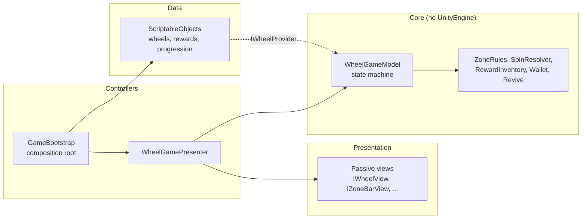

# Vertigo Wheel

A risk-and-reward wheel of fortune made for the Vertigo Games Game Developer demo. You spin a wheel, bank the reward and move to the next zone, and every spin can land on a bomb that wipes out everything you've collected. Rewards grow each zone. Every 5th zone is a safe silver spin with no bomb, and every 30th zone is a golden super spin with special rewards. You can only walk away with your rewards on those risk-free zones.

- **Unity:** 2021.3 LTS (2021.3.45f2), Built-in render pipeline, landscape.
- **Libraries:** TextMeshPro, DOTween, Sprite Atlas (V1).
- **APK:** see the [Releases](../../releases) page.

| 20:9 | 16:9 | 4:3 |
| --- | --- | --- |
|  |  |  |

## Running it

1. Open the project in Unity 2021.3 LTS.
2. Open `Assets/_Project/Scenes/game.unity` and press Play.

The `Vertigo` menu has the project tools:

| Menu | What it does |
| --- | --- |
| Build Game Scene | Rebuilds `game.unity` from code, following every UI rule, and wires all references. |
| Validate UI Hierarchy | Reports UI rule violations in the open scenes. |
| Capture UI Screenshots | Renders the UI at 20:9, 16:9 and 4:3 into `Screenshots/`, in edit mode or play mode. |
| Build Android APK | Applies the release player settings (landscape, IL2CPP, ARM64, min API 23) and builds `Builds/Android/VertigoWheel.apk`. |

## Game rules

| Rule | Where |
| --- | --- |
| Every wheel has rewards plus one bomb; the bomb loses all collected rewards. | `WheelGameModel.TryCompleteSpin`, the bronze `wheel_*` assets |
| Rewards get better every zone. | `ZoneProgressionSO` (reward multiplier per zone, wheel tiers from zones 1 / 11 / 21) |
| Every 5th zone is a safe silver spin with no bomb. | `ZoneRules`, `wheel_silver_*` |
| Every 30th zone is a super golden spin with special rewards and no bomb. | `ZoneRules`, `wheel_golden` |
| You can only leave on safe or super zones, and never while the wheel is spinning. | `WheelGameModel.CanLeave` |
| Bonus: revive with currency. | `CurrencyReviveService`; the cost goes up with each revive in a run |
| Restart after losing or collecting. | `WheelGameModel.TryRestart`, summary popup |

Safe and super zones throw an error if their wheel has a bomb, so a content mistake can't produce an illegal wheel. `ZoneProgressionSO.OnValidate` and the content validation tests catch this in the editor too.

## Editing content in the editor

Everything you might want to tune is a ScriptableObject in `Assets/_Project/ScriptableObjects`:

- **`Rewards/reward_*`**: one asset per reward (id, name, type, icon). `reward_catalog` lists them all.
- **`Wheels/wheel_*`**: the 8 slices of each wheel (reward, base amount, weight, whether the amount grows with the zone, bomb), plus its sprites and title.
- **`Progression/zone_progression`**: the safe and super intervals, the reward growth per zone, which wheels each tier uses, and the super wheel.
- **`Settings/game_settings`**: the wallet currency, starting balance, revive cost, and an optional fixed random seed.
- **`Settings/wheel_spin_settings`**: spin duration, number of turns, ease, landing jitter and all the feedback timings.
- **`Settings/game_texts`**: the summary popup texts.

## Architecture

The structure is MVP with a pure C# domain. Each layer is its own assembly, and dependencies only point inward.

- **`Vertigo.Wheel.Core`** (`noEngineReferences`): all the game rules.
  - `WheelGameModel` is a small state machine: Ready → Spinning → Ready / Bombed → Lost / Collected.
  - The spin result is decided when the spin starts and applied after the animation finishes, so the view can never change the outcome.
  - Randomness, wheels, inventory, revive and reward claiming all sit behind interfaces.
- **`Vertigo.Wheel.Data`**: ScriptableObject content plus adapters to the Core interfaces (`ScriptableWheelProvider`, `PlayerPrefsCurrencyWallet`).
- **`Vertigo.Wheel.Presentation`**: passive MonoBehaviour views.
  - Each view exposes C# events and has its own interface.
  - All animation uses DOTween and only ever moves a child transform, never the view root.
- **`Vertigo.Wheel.Controllers`**:
  - `WheelGamePresenter` turns model events into view calls and view events into model commands.
  - `GameBootstrap` builds the object graph by hand, with no singletons.
- **`Vertigo.Wheel.Editor`**: the scene builder, UI validator, screenshot capture and Android build.

## UI rules from the brief

| Rule | How |
| --- | --- |
| Canvas Scaler set to Expand | 1920x1080 reference, `ScreenMatchMode.Expand`. The validator checks it. |
| All text is TextMeshPro | The validator reports any legacy `Text`. |
| Changeable UI ends in `_value` | Fields named `...Value` must reference objects named `..._value`; the validator checks this. |
| Names go from general to specific | `ui_<kind>_<area>_<detail>`, for example `ui_image_wheel_base_value` or `ui_button_spin`. |
| No needless Raycast Target / Maskable | Raycast is only on button graphics, scroll surfaces and popup blockers; Maskable only below a `RectMask2D`. |
| Animators off the root | Tweens target `*_anim`, `*_fade` and `ui_wheel_rotation` children. |
| Correct anchors for 20:9, 16:9, 4:3 | The zone bar is stretched across the top, the reward panel down the left, and the wheel and popups are centred. The screenshots above come from the capture tool. |
| Button references set in OnValidate | `ComponentLookup.AssignFromChildren` finds them by name (`ui_button_*`). |
| No OnClick in the editor | Listeners are added and removed in code; the validator reports persistent listeners. |
| Sliced sprites, nothing stretched | Panels and buttons use sliced borders; icons use Preserve Aspect. The validator checks the aspect ratio. |

The rules are also enforced by tests: the EditMode suite runs `UiHierarchyValidator` over `game.unity`.

## Tests

To run them, open **Window → General → Test Runner → EditMode → Run All**. The suite covers:

- Zone rules and the weighted spin resolver.
- Inventory, wallet and revive.
- The full model state machine.
- The presenter, run against fake views.
- Slice data and the shipped content (the right bomb count on every wheel).
- The UI validator and the built scene.
